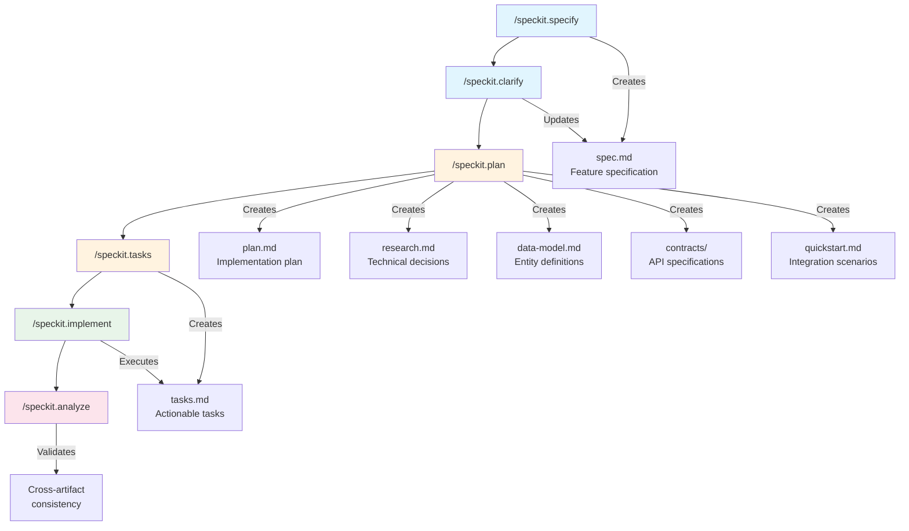

# FocusHelper

A task manager web app with three columns (Tasks, Meetings, Backburner) built with Vite + React + Tailwind CSS + shadcn/ui.

## SpecKit Workflow

This project uses **SpecKit**, a specification-driven development workflow learned from the LinkedIn Learning course:

**[Spec-Driven Development with GitHub Spec-Kit](https://www.linkedin.com/learning/spec-driven-development-with-github-spec-kit/)**

Features are developed through a structured process that ensures clarity, traceability, and quality.

### Workflow Steps



### Step-by-Step Process

| Step | Command | Output | Purpose |
|------|---------|--------|---------|
| 1 | `/speckit.specify` | `spec.md` | Create feature specification from natural language description |
| 2 | `/speckit.clarify` | Updated `spec.md` | Identify and resolve underspecified areas via clarifying questions |
| 3 | `/speckit.plan` | `plan.md`, `research.md`, `data-model.md`, `contracts/`, `quickstart.md` | Generate technical implementation plan with design artifacts |
| 4 | `/speckit.tasks` | `tasks.md` | Break plan into actionable, dependency-ordered tasks |
| 5 | `/speckit.implement` | Source code | Execute implementation by processing tasks |
| 6 | `/speckit.analyze` | Validation report | Cross-artifact consistency and quality analysis |

### Generated Artifacts

After running through steps 1-4, the following structure is created:

```
specs/001-task-manager-columns/
├── spec.md           # Feature specification with user stories
├── plan.md           # Implementation plan with tech stack
├── research.md       # Technical decisions with rationale
├── data-model.md     # Entity definitions (Task, Column)
├── quickstart.md     # Integration scenarios
├── tasks.md          # 46 actionable tasks organized by user story
├── contracts/
│   └── storage-api.md  # Storage interface contract
└── checklists/
    └── requirements.md # Requirements validation checklist
```

## Feature: Three-Column Task Manager

### User Stories

1. **US1 (P1)**: Create and View Tasks - Add tasks to any column
2. **US2 (P2)**: Edit Existing Tasks - Modify task details
3. **US3 (P3)**: Move Tasks Between Columns - Drag-and-drop functionality
4. **US4 (P4)**: Delete Tasks - Remove unwanted tasks

### Tech Stack

- **Build Tool**: Vite 6.x
- **UI Framework**: React 18.x with TypeScript
- **Styling**: Tailwind CSS 3.x
- **Components**: shadcn/ui
- **Drag-and-Drop**: @dnd-kit
- **Storage**: Browser localStorage

## Getting Started

```bash
# Install dependencies
npm install

# Start development server
npm run dev

# Open in browser
# http://localhost:5173
```

## Project Structure

```
FocusHelper/
├── src/
│   ├── components/
│   │   ├── ui/              # shadcn/ui components
│   │   ├── TaskCard.tsx     # Individual task display
│   │   ├── TaskColumn.tsx   # Column container
│   │   ├── TaskBoard.tsx    # Main board layout
│   │   └── TaskForm.tsx     # Add/Edit task dialog
│   ├── hooks/
│   │   └── useTaskStorage.ts # localStorage persistence
│   ├── types/
│   │   └── task.ts          # Task and Column types
│   ├── lib/
│   │   └── utils.ts         # Utility functions
│   ├── App.tsx
│   ├── main.tsx
│   └── index.css
├── specs/                   # SpecKit specifications
├── .specify/                # SpecKit configuration
└── CLAUDE.md               # AI assistant instructions
```

## Acknowledgments

SpecKit workflow learned from:
- **[Spec-Driven Development with GitHub Spec-Kit](https://www.linkedin.com/learning/spec-driven-development-with-github-spec-kit/)** - LinkedIn Learning

## License

MIT
