# FocusHelper

A task manager web app with three columns (Tasks, Meetings, Backburner) built with Vite + React + Tailwind CSS + shadcn/ui.

## Acknowledgments and Credits

- **[Spec-Driven Development with GitHub Spec-Kit](https://www.linkedin.com/learning/spec-driven-development-with-github-spec-kit/)** by Morten Rand-Hendriksen - LinkedIn Learning
- **[How to write a good spec for AI agents](https://addyosmani.com/blog/good-spec/)** by Addy Osmani
- **[Understanding Spec-Driven-Development: Kiro, spec-kit, and Tessl](https://martinfowler.com/articles/exploring-gen-ai/sdd-3-tools.html)** by Birgitta Böckeler

## References

- **[GitHub Spec-Kit](https://github.com/github/spec-kit)** - Official SpecKit repository

## SpecKit Workflow

This project uses **SpecKit**, a specification-driven development workflow. Features are developed through a structured process that ensures clarity, traceability, and quality.

### Workflow Steps

```mermaid
flowchart LR
    subgraph Phase1["📋 Phase 1: Specification"]
        A["1. /speckit.specify<br/>─────────────<br/>Create spec.md"]
        B["2. /speckit.clarify<br/>─────────────<br/>Refine spec.md"]
        A --> B
    end

    subgraph Phase2["📐 Phase 2: Planning"]
        C["3. /speckit.plan<br/>─────────────<br/>Create plan.md<br/>research.md<br/>data-model.md<br/>contracts/<br/>quickstart.md"]
        D["4. /speckit.tasks<br/>─────────────<br/>Create tasks.md"]
        C --> D
    end

    subgraph Phase3["🚀 Phase 3: Execution"]
        E["5. /speckit.implement<br/>─────────────<br/>Execute tasks<br/>Generate code"]
        F["6. /speckit.analyze<br/>─────────────<br/>Validate quality"]
        E --> F
    end

    Phase1 --> Phase2
    Phase2 --> Phase3

    style A fill:#1565c0,stroke:#0d47a1,color:#fff
    style B fill:#1565c0,stroke:#0d47a1,color:#fff
    style C fill:#f57f17,stroke:#e65100,color:#fff
    style D fill:#f57f17,stroke:#e65100,color:#fff
    style E fill:#2e7d32,stroke:#1b5e20,color:#fff
    style F fill:#ad1457,stroke:#880e4f,color:#fff
```



## Demo

Working application built using the SpecKit workflow:


*Three-column task manager with drag-and-drop support, localStorage persistence, and accessible keyboard navigation.*

### Visual Summary

```
┌─────────────────────────────────────────────────────────────────────────────┐
│                           SpecKit Workflow                                   │
├─────────────────────────────────────────────────────────────────────────────┤
│                                                                             │
│  ┌─────────────┐    ┌─────────────┐    ┌─────────────┐    ┌─────────────┐  │
│  │   SPECIFY   │───▶│   CLARIFY   │───▶│    PLAN     │───▶│    TASKS    │  │
│  │             │    │             │    │             │    │             │  │
│  │  spec.md    │    │  spec.md    │    │  plan.md    │    │  tasks.md   │  │
│  │  (create)   │    │  (refine)   │    │  research   │    │  (46 tasks) │  │
│  │             │    │             │    │  data-model │    │             │  │
│  │             │    │             │    │  contracts  │    │             │  │
│  └─────────────┘    └─────────────┘    └─────────────┘    └─────────────┘  │
│                                                                  │          │
│                                                                  ▼          │
│                                        ┌─────────────┐    ┌─────────────┐  │
│                                        │   ANALYZE   │◀───│  IMPLEMENT  │  │
│                                        │             │    │             │  │
│                                        │  Validate   │    │  Execute    │  │
│                                        │  Quality    │    │  Tasks      │  │
│                                        └─────────────┘    └─────────────┘  │
│                                                                             │
└─────────────────────────────────────────────────────────────────────────────┘
```

### Step-by-Step Process

| Step | Command | Output | Purpose |
|------|---------|--------|---------|
| 1 | `/speckit.specify` | `spec.md` | Create feature specification from natural language description |
| 2 | `/speckit.clarify` | Updated `spec.md` | Identify and resolve underspecified areas via clarifying questions |
| 3 | `/speckit.plan` | `plan.md`, `research.md`, `data-model.md`, `contracts/`, `quickstart.md` | Generate technical implementation plan with design artifacts |
| 4 | `/speckit.tasks` | `tasks.md` | Break plan into actionable, dependency-ordered tasks |
| 5 | `/speckit.implement` | Source code | Execute implementation by processing tasks |
| 6 | `/speckit.analyze` | Validation report | Cross-artifact consistency and quality analysis |

### Generated Artifacts

After running through steps 1-4, the following structure is created:

```
specs/001-task-manager-columns/
├── spec.md           # Feature specification with user stories
├── plan.md           # Implementation plan with tech stack
├── research.md       # Technical decisions with rationale
├── data-model.md     # Entity definitions (Task, Column)
├── quickstart.md     # Integration scenarios
├── tasks.md          # 46 actionable tasks organized by user story
├── contracts/
│   └── storage-api.md  # Storage interface contract
└── checklists/
    └── requirements.md # Requirements validation checklist
```

## Feature: Three-Column Task Manager

### User Stories

1. **US1 (P1)**: Create and View Tasks - Add tasks to any column
2. **US2 (P2)**: Edit Existing Tasks - Modify task details
3. **US3 (P3)**: Move Tasks Between Columns - Drag-and-drop functionality
4. **US4 (P4)**: Delete Tasks - Remove unwanted tasks

### Tech Stack

- **Build Tool**: Vite 6.x
- **UI Framework**: React 18.x with TypeScript
- **Styling**: Tailwind CSS 3.x
- **Components**: shadcn/ui
- **Drag-and-Drop**: @dnd-kit
- **Storage**: Browser localStorage

## Getting Started

```bash
# Install dependencies
npm install

# Start development server
npm run dev

# Open in browser
# http://localhost:5173
```

## Project Structure

```
FocusHelper/
├── src/
│   ├── components/
│   │   ├── ui/              # shadcn/ui components
│   │   ├── TaskCard.tsx     # Individual task display
│   │   ├── TaskColumn.tsx   # Column container
│   │   ├── TaskBoard.tsx    # Main board layout
│   │   └── TaskForm.tsx     # Add/Edit task dialog
│   ├── hooks/
│   │   └── useTaskStorage.ts # localStorage persistence
│   ├── types/
│   │   └── task.ts          # Task and Column types
│   ├── lib/
│   │   └── utils.ts         # Utility functions
│   ├── App.tsx
│   ├── main.tsx
│   └── index.css
├── specs/                   # SpecKit specifications
├── .specify/                # SpecKit configuration
└── CLAUDE.md               # AI assistant instructions
```
